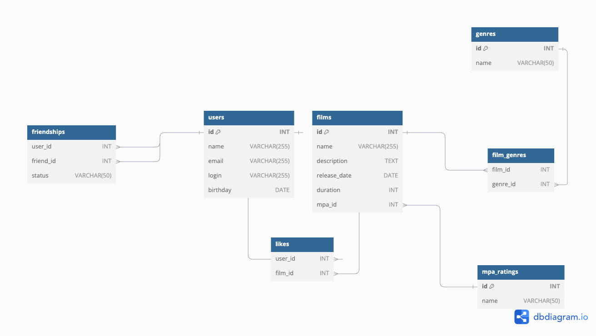

# java-filmorate
Template repository for Filmorate project.

## Схема базы данных

Вот схема базы данных, используемой в проекте Filmorate:

### Описание схемы
- users — таблица пользователей.
- films — таблица фильмов.
- genres — таблица жанров.
- mpa_ratings — таблица возрастных рейтингов.
- film_genres — связь фильмов с жанрами.
- likes — связь фильмов с лайками пользователей.
- friendships — дружеские связи пользователей.

### Примеры SQL-запросов
#### 
1. Получение списка всех фильмов:
SELECT * FROM films;

2. Получение пользователей и их друзей:
SELECT u.*
FROM users u
JOIN friendships f ON u.id = f.friend_id
WHERE f.user_id = ?;

3. Получение фильмов с жанрами:
SELECT f.name AS film_name, g.name AS genre_name
FROM films f
JOIN film_genres fg ON f.id = fg.film_id
JOIN genres g ON fg.genre_id = g.id;

4. Поставить лайк фильму:
INSERT INTO likes (film_id, user_id) VALUES (?, ?);